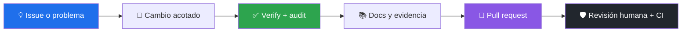

# 🛠️ Contribuir

[**← README**](README.md) · [**✅ Verificación**](docs/VERIFICATION.md) · [**🔒 Seguridad**](SECURITY.md) · [**🎨 Estilo documental**](docs/STYLE_GUIDE.md)

Gracias por mejorar AWS Desktop Studio. Busca primero un issue existente y mantén cada cambio pequeño, verificable y con alcance explícito.

## ⚙️ Entorno

```powershell
pnpm install --frozen-lockfile
pnpm run verify
pnpm audit --audit-level=high
```

Node.js 22 LTS es la referencia de desarrollo y CI. La aplicación se distribuye para Windows, aunque las pruebas puras también corren en Ubuntu.

## ☁️ Reglas para integraciones AWS

Toda consulta nueva debe:

1. usar argumentos estructurados y `shell: false`;
2. validar perfil, región e identificadores;
3. evitar datos secretos en salida, logs y fixtures;
4. incluir prueba determinista del comando construido;
5. documentar permisos IAM y posibles costos.

Toda mutación nueva, además, necesita allowlist cerrada, modo operativo, confirmación nativa inmediatamente anterior y una descripción clara del efecto reversible o irreversible.

## 🔁 Flujo de contribución



### Checklist del pull request

- Ejecuta `pnpm run verify` y la auditoría de dependencias.
- Actualiza documentación y capturas si cambia comportamiento visible.
- No incluyas credenciales, IDs de cuenta, ARN reales ni respuestas AWS personales.
- Usa Conventional Commits (`feat:`, `fix:`, `docs:`, `ci:`, `test:`).
