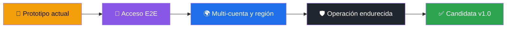

# 📊 Estado verificable de la implementación — v0.1.1

[**← README**](README.md) · [**✅ Evidencia**](docs/VERIFICATION.md) · [**🗺️ Roadmap**](ROADMAP.md) · [**🔬 Investigación**](docs/09-investigacion-implementacion-aws.md)

Última verificación local: 2026-09-10.

## 🧪 Clasificación de madurez

**Estado global: implementación en desarrollo.** No es un producto terminado ni una solución universal de acceso AWS. La existencia de localhost, Setup, Portable y releases demuestra que el proyecto se ejecuta y se empaqueta; no demuestra que todos los proveedores, cuentas, regiones y ciclos de sesión estén resueltos.

| Superficie | Evidencia existente | Madurez / limitación |
|---|---|---|
| Aplicación Electron | `pnpm start`; main/preload/renderer implementados | Prototipo funcional; falta QA instalada, actualización y firma |
| Interfaz localhost | `pnpm run start:web`; loopback y token anti-CSRF | Prototipo funcional; no comparte cookies con AWS Console |
| Identidad | AWS Login, SSO, perfiles, AssumeRole y cadena estándar; STS | Integración inicial; faltan pruebas end-to-end por modalidad, expiración y recuperación |
| Consultas AWS | 16 áreas individuales contando Cost Explorer | Cobertura acotada; faltan paginación, regiones dinámicas y matriz de compatibilidad |
| Inventario | 15 integraciones agregadas por cuenta/región | Vista inicial; no equivale a inventario completo AWS |
| Mutaciones | start/stop/reboot de EC2 con modo opt-in y diálogo nativo | Experimental; usar únicamente en sandbox |
| Catálogo educativo | 28 entradas y 20 tutoriales | Documentación, no soporte operativo de todo el catálogo |
| Pruebas | 15 casos unitarios | No cubren flujos completos de navegador/AWS ni instaladores |
| Automatización | 4 workflows: CI, CodeQL, Pages y build/release Windows | Verifica código y empaquetado, no acceso real a cuentas AWS |
| Release Windows | Setup, Portable, SBOM y SHA-256 por tag | Despliegue inicial; sin firma comercial ni garantía de producción |

## 🚫 Qué no debe inferirse de v0.1.1

- No significa que el acceso mediante una consola ya abierta se transfiera a localhost.
- No certifica compatibilidad completa con root, IAM, federación, SSO, roles y workloads.
- No convierte las consultas actuales en una réplica de AWS Console o AWS Resource Explorer.
- No autoriza uso productivo ni elimina la necesidad de IAM de mínimo privilegio.
- No declara terminados los 12 módulos educativos.

La ruta de madurez y sus criterios están en [ROADMAP.md](ROADMAP.md) y [docs/08-referencias-y-plan-de-madurez.md](docs/08-referencias-y-plan-de-madurez.md).
