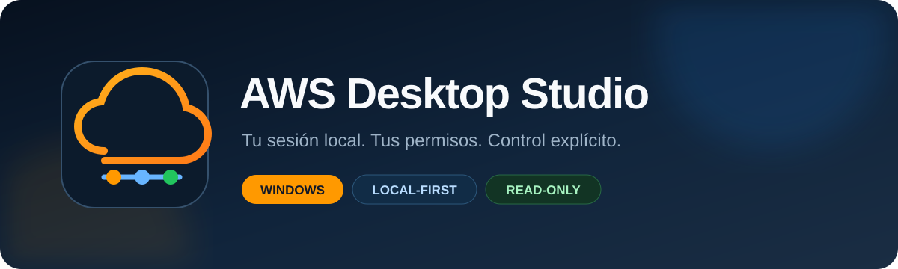

<div align="center">
  

  # ☁️ AWS Desktop Studio

  **Implementación experimental para explorar integraciones AWS desde Windows y localhost.**

  [](https://github.com/vladimiracunadev-create/aws-desktop-studio/actions/workflows/ci.yml)
  [](https://github.com/vladimiracunadev-create/aws-desktop-studio/actions/workflows/codeql.yml)
  [](https://vladimiracunadev-create.github.io/aws-desktop-studio/)
  [](LICENSE)
  [](#-requisitos)
  [](CHANGELOG.md)
  [](docs/VERIFICATION.md)
  [](PROJECT_STATUS.md)
  [](package.json)

  [**🌐 Sitio**](https://vladimiracunadev-create.github.io/aws-desktop-studio/) · [**🚀 Inicio rápido**](#-inicio-rápido) · [**🧭 Arquitectura**](docs/07-arquitectura-interna.md) · [**📚 Documentación**](#-documentación) · [**🔒 Seguridad**](SECURITY.md) · [**🗺️ Roadmap**](ROADMAP.md)
</div>

---

> [!WARNING]
> **IMPLEMENTACIÓN EN DESARROLLO — v0.1.1.** Existe una aplicación ejecutable, localhost y artefactos Windows iniciales, pero el flujo de acceso AWS todavía está en validación y mejora. Esta versión demuestra despliegue y consultas acotadas; no representa un producto terminado ni una solución universal de autenticación AWS.

| Integraciones de inventario | Áreas individuales | Tutoriales | Pruebas unitarias | Workflows |
|:---:|:---:|:---:|:---:|:---:|
| **15** | **16** | **20** | **15** | **4** |

## 🎯 Qué es y qué no es

Este repositorio es un prototipo funcional y verificable para aprender, explorar integraciones y madurar una aplicación local de AWS. Algunas consultas llaman cuentas reales mediante AWS CLI y STS, pero su cobertura, experiencia de acceso, renovación de sesiones, paginación y soporte multi-cuenta/multi-región siguen incompletos.

- **Sí es:** una base de desarrollo con Electron, localhost loopback, empaquetado Windows, controles de seguridad, pruebas unitarias e integraciones de lectura acotadas.
- **No es:** una réplica de AWS Console, un gestor de identidad terminado, una garantía de acceso para cualquier modalidad ni una herramienta lista para producción.
- **Los releases 0.x iniciales:** versionan el empaquetado y despliegue de la implementación. No certifican que el acceso AWS esté resuelto.

## ✨ Qué demuestra

AWS Desktop Studio reúne administración, laboratorio y tutorial en una aplicación Electron local-first:

- conecta identidades root, IAM o federadas mediante el proveedor oficial `aws login`, sin copiar credenciales;
- detecta perfiles AWS CLI, IAM Identity Center/SSO, AssumeRole y la cadena estándar del entorno;
- identifica el proveedor seleccionado sin leer ni mostrar Access Keys y presenta las conexiones en orden de prioridad;
- bloquea el espacio de trabajo hasta validar la identidad efectiva con AWS STS;
- valida la identidad activa con AWS STS;
- incluye comandos experimentales de lectura para 16 áreas AWS y presenta respuestas acotadas;
- genera un inventario agregado por cuenta y región, mostrando también los servicios que IAM no autorizó;
- incorpora 20 tutoriales y un catálogo de 28 servicios/capacidades;
- separa lectura y mutación con controles visibles y confirmación;
- incluye un centro de tareas local con prioridad, fecha, servicio y estado;
- ejecuta AWS CLI con argumentos estructurados, `shell: false`, renderer aislado y permisos del navegador denegados;
- publica instalador NSIS y versión portable mediante un release reproducible con SBOM y SHA-256.

Estas capacidades demuestran piezas técnicas existentes, no madurez de producto. Consulta [Estado verificable](PROJECT_STATUS.md), [Roadmap](ROADMAP.md) y [Referencias y plan de madurez](docs/08-referencias-y-plan-de-madurez.md) antes de evaluar el alcance.

## 🚀 Inicio rápido

### 📋 Requisitos

- Windows 10/11 x64.
- Node.js 22 LTS para desarrollo.
- AWS CLI v2 disponible en `PATH`.
- AWS CLI v2 con soporte para `aws login`, o un perfil/proveedor AWS válido.

```powershell
aws configure sso
aws sso login --profile mi-perfil
aws sts get-caller-identity --profile mi-perfil
```

### 💻 Ejecutar desde código

```powershell
git clone https://github.com/vladimiracunadev-create/aws-desktop-studio.git
cd aws-desktop-studio
pnpm install --frozen-lockfile
pnpm run verify
pnpm start
```

### 🌐 Ejecutar en localhost

```powershell
pnpm run start:web
```

Abre `http://127.0.0.1:4173`. El servidor escucha únicamente en loopback y reutiliza los perfiles de AWS CLI del usuario actual. Las consultas de identidad y recursos pasan por una API local con validación de origen y token anti-CSRF. Las mutaciones EC2 continúan reservadas a Electron, donde existe confirmación nativa.

La aplicación selecciona `sa-east-1` inicialmente, intenta adoptar la región del perfil elegido y nunca almacena Access Keys ni tokens. La primera pantalla permite usar AWS Login, configurar SSO, elegir la cadena estándar del entorno, crear un perfil AssumeRole, validar la identidad y abrir la consola oficial. El explorador permanece bloqueado hasta completar la validación STS.

**AWS Login** es la opción directa para una persona que ya puede autenticarse en la consola como root, usuario IAM o identidad federada. AWS CLI abre el sitio oficial, obtiene credenciales temporales y crea o actualiza el perfil indicado. La aplicación espera el resultado y valida inmediatamente la cuenta y el ARN efectivos.

El asistente visual de IAM Identity Center incluye nombre de sesión, Start/Issuer URL, región SSO, Account ID, rol/permission set, nombre de perfil, región predeterminada y el scope fijo `sso:account:access`. El asistente AssumeRole crea una cadena segura desde un perfil de origen hacia un rol de otra cuenta. Usuario/email, contraseña, controles de seguridad y MFA se introducen exclusivamente en AWS.

Las tareas personales se guardan localmente en el almacenamiento de la aplicación. No se sincronizan con AWS y nunca contienen credenciales salvo que el usuario las escriba expresamente, algo que se debe evitar.

### 🪟 Construir Windows

```powershell
pnpm run dist:win
```

El pipeline de release genera dos ejecutables diferenciados —Setup y Portable—, un SBOM CycloneDX y `SHA256SUMS.txt`. Los binarios comunitarios no están firmados con un certificado comercial; Windows puede mostrar una advertencia SmartScreen.

> [!IMPORTANT]
> Un artefacto instalable solo demuestra que el código fue empaquetado. No demuestra que todas las modalidades de acceso AWS funcionen ni que la aplicación esté lista para producción.

## 🧩 Cobertura funcional

| Área | Servicios con consulta real | Resultado |
|---|---|---|
| Identidad | STS | cuenta y ARN efectivos |
| Cómputo | EC2 | instancias; start/stop/reboot con doble control |
| Storage | S3 | buckets y fecha de creación |
| Serverless | Lambda | runtime, memoria, timeout y modificación |
| Datos | RDS, DynamoDB | instancias DB y tablas |
| Redes | VPC | CIDR, estado y VPC por defecto |
| Seguridad | IAM, Secrets Manager | roles y metadatos; nunca valores secretos |
| Observabilidad / IaC | CloudWatch Logs, CloudFormation | grupos de logs y stacks |
| Contenedores | ECS, EKS | clusters |
| Integración | API Gateway, SQS, SNS | APIs, colas y topics |
| FinOps | Cost Explorer | costo no amortizado del mes actual |

Bedrock, SageMaker, Redshift, Glue, Athena, Route 53, CloudFront, WAF, Organizations, Backup, CodePipeline y Migration Hub/DMS están documentados como módulos educativos; no se presentan como integraciones operativas.

## 🔒 Modelo de seguridad

```mermaid
flowchart LR
    U["👤 Usuario"] --> UI["🖥️ Renderer aislado<br/>Electron o localhost"]
    UI -->|"API mínima · sin secretos"| B["🛡️ Frontera segura<br/>IPC o loopback"]
    B --> C["⚙️ Proceso principal<br/>validación + allowlist"]
    C -->|"spawn sin shell"| CLI["☁️ AWS CLI v2"]
    CLI --> ID["🔑 Proveedor oficial<br/>Login · SSO · rol · workload"]
    ID --> STS["✅ STS<br/>cuenta + ARN"]
    STS --> API["📦 APIs AWS<br/>lectura acotada"]

    style U fill:#1f6feb,color:#fff
    style B fill:#8957e5,color:#fff
    style C fill:#21262d,color:#fff
    style CLI fill:#ff9900,color:#111
    style STS fill:#2da44e,color:#fff
    style API fill:#0ea5e9,color:#fff
```



Controles principales:

- lectura por defecto y modo operativo opt-in;
- confirmación nativa inmediatamente antes de cada mutación EC2;
- allowlist de comandos, acciones, protocolos y nombres de tutorial;
- validación estricta de perfil, región e Instance ID;
- `AWS_PAGER` desactivado, timeout por operación y sin shell intermedio;
- CSP restrictiva, permisos web denegados y bloqueo de navegación emergente;
- CI multi-OS, auditoría pnpm, Dependency Review, CodeQL y Dependabot.

AWS IAM continúa siendo la autoridad final. La aplicación no amplía los permisos del perfil elegido.

## 📚 Documentación

| Ruta | Objetivo |
|---|---|
| [Instalación y conexión](docs/01-instalacion-y-conexion.md) | AWS CLI, SSO y perfiles |
| [Modelo mental AWS](docs/02-modelo-mental-aws.md) | cuenta, región, servicio y recurso |
| [Modos de trabajo](docs/03-modos-de-trabajo.md) | lectura, operación y confirmaciones |
| [Seguridad y costos](docs/04-seguridad-y-costos.md) | límites, IAM y FinOps |
| [Laboratorios](docs/05-laboratorios.md) | práctica guiada |
| [Troubleshooting](docs/06-troubleshooting.md) | diagnóstico frecuente |
| [Arquitectura interna](docs/07-arquitectura-interna.md) | procesos, IPC y amenazas |
| [Mapa de servicios](docs/aws-service-map.md) | catálogo completo |
| [Evidencia verificable](docs/VERIFICATION.md) | pruebas y fuentes de verdad |
| [Referencias y plan de madurez](docs/08-referencias-y-plan-de-madurez.md) | comparación open source, brechas y prioridades |
| [Investigación de implementación AWS](docs/09-investigacion-implementacion-aws.md) | proveedores, seguridad, inventario, historial y criterios E2E |
| [Skill general de auditoría cloud](skills/cloud-implementation-research-audit/SKILL.md) | investigación reutilizable para AWS, Azure, Google Cloud y otros proveedores |
| [Estándar visual Markdown](docs/STYLE_GUIDE.md) | portada, navegación, iconos, tablas, diagramas y reglas de honestidad visual verificadas en CI |

## 🛠️ Desarrollo y contribución

```powershell
pnpm install --frozen-lockfile
pnpm run check
pnpm test
pnpm run test:coverage
pnpm audit --audit-level=high
```

Consulta [CONTRIBUTING.md](CONTRIBUTING.md) antes de abrir un cambio. Las operaciones mutables nuevas deben incorporar allowlist, validación, confirmación, pruebas y documentación del impacto/costo.

## 🧪 Alcance honesto y estado de madurez

Este repositorio contiene una aplicación ejecutable, un modo localhost y consultas AWS reales acotadas. Usa credenciales administradas por AWS CLI, pero no solicita secretos ni implementa un proveedor de identidad propio. No reemplaza la consola, no aprovisiona infraestructura, no promete cobertura total del catálogo AWS y permanece en desarrollo activo. Las firmas comerciales, distribución en Microsoft Store y una matriz completa de acceso están fuera del alcance de v0.1.1.

## ⚖️ Licencia y marcas

[MIT](LICENSE). AWS, Amazon Web Services y los nombres de sus servicios son marcas de Amazon.com, Inc. o sus afiliadas. Este proyecto es independiente y no es un producto oficial de AWS.
