# 📦 Publicación de implementaciones en desarrollo

[**← README**](README.md) · [**🕒 Changelog**](CHANGELOG.md) · [**✅ Verificación**](docs/VERIFICATION.md) · [**📊 Estado**](PROJECT_STATUS.md)

> [!WARNING]
> Publicar un binario no certifica acceso AWS ni madurez de producción.

Los releases actuales versionan entregas y despliegues del proyecto. Un tag, instalador o portable no declara resuelto el acceso AWS, no certifica todas las modalidades y no convierte el repositorio en un producto terminado.

Los releases se construyen exclusivamente desde un tag `v*` mediante `.github/workflows/build-windows.yml`.

## 🔁 Flujo de release

```mermaid
flowchart LR
    C["🧹 Árbol limpio"] --> V["✅ Verify + audit"]
    V --> P["🪟 Smoke Windows"]
    P --> T["🏷️ Tag v*"]
    T --> G["⚙️ GitHub Actions"]
    G --> A["📦 Setup + Portable"]
    A --> I["🔐 SBOM + SHA-256"]
    I --> M["👤 Verificación manual"]

    style V fill:#2da44e,color:#fff
    style G fill:#1f6feb,color:#fff
    style I fill:#8957e5,color:#fff
    style M fill:#21262d,color:#fff
```



## ✅ Checklist

1. Verificar árbol limpio, versión y changelog.
2. Ejecutar `pnpm install --frozen-lockfile`, `pnpm run verify` y `pnpm audit --audit-level=high`.
3. Construir localmente con `pnpm run dist:win` cuando se requiera smoke test visual.
4. Crear y subir el tag anotado `vX.Y.Z`.
5. Confirmar que GitHub Actions publique Setup, Portable, SBOM CycloneDX y `SHA256SUMS.txt`.
6. Descargar los artefactos, verificar SHA-256 y ejecutar un smoke test en Windows.

## 🏷️ Etiquetado obligatorio del release

Mientras el proyecto permanezca en serie 0.x, las notas deben incluir:

- estado: implementación en desarrollo;
- finalidad: despliegue inicial o incremental;
- modalidades de acceso probadas y no probadas;
- limitaciones conocidas del localhost y del instalador;
- advertencia de no usar como garantía de producción.

El éxito de `build-windows.yml` prueba que los artefactos se construyeron. No ejecuta una autenticación real contra cuentas de usuarios y no valida el ciclo completo de AWS Login, SSO, AssumeRole o workloads.

## 🔐 Integridad

```powershell
Get-FileHash .\AWS-Desktop-Studio-Portable-0.1.1-x64.exe -Algorithm SHA256
```

El hash debe coincidir con `SHA256SUMS.txt`. Los binarios de v0.1.1 no incluyen firma comercial; esta limitación y el carácter experimental deben mantenerse visibles en el release.
