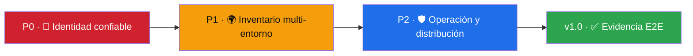

# 🗺️ Roadmap de madurez

[**← README**](README.md) · [**📊 Estado actual**](PROJECT_STATUS.md) · [**🔬 Investigación**](docs/09-investigacion-implementacion-aws.md)

Las versiones indicadas son objetivos de desarrollo, no compromisos de fecha ni certificaciones automáticas de producción. Un release solo marca una entrega del repositorio; cada capacidad debe cumplir criterios verificables propios.

## 🔑 P0 — acceso AWS confiable

- Asistente único para credenciales de consola, SSO, perfil, AssumeRole y workload.
- Pruebas end-to-end por modalidad, incluyendo cancelación, expiración y renovación.
- Cuenta, ARN, proveedor, región y vencimiento visibles antes de consultar o modificar.
- Regiones descubiertas dinámicamente.
- Diagnóstico accionable sin pedir ni mostrar secretos.

## 🌍 P1 — exploración multi-cuenta y multi-región

- Inventario paginado y agregación por cuentas, roles y regiones.
- Resource Explorer y Resource Groups Tagging API como fuentes complementarias.
- Exploradores detallados de S3, CloudWatch, VPC, ECS, EKS y costos.
- Estados diferenciados: sin recursos, sin permiso, servicio no disponible y error transitorio.

## 🛡️ P2 — operaciones y plataforma

- Flujos reversibles con vista previa, mínimo privilegio y auditoría local.
- Integración gradual con AWS SDK, Terraform, CloudFormation y CDK.
- LocalStack como laboratorio explícitamente separado de AWS real.
- Firma Authenticode, actualización segura, rollback, accesibilidad y pruebas de instalador.

## ✅ Criterios para una futura v1.0

- Matriz pública de modalidades y sistemas operativos probada end-to-end.
- Inventario multi-región/multi-cuenta con paginación y límites documentados.
- Renovación de sesiones y recuperación de errores sin reinicios ambiguos.
- Pruebas de seguridad, interfaz e instalador además de pruebas unitarias.
- Documentación que distinga con precisión capacidades soportadas, experimentales y educativas.
