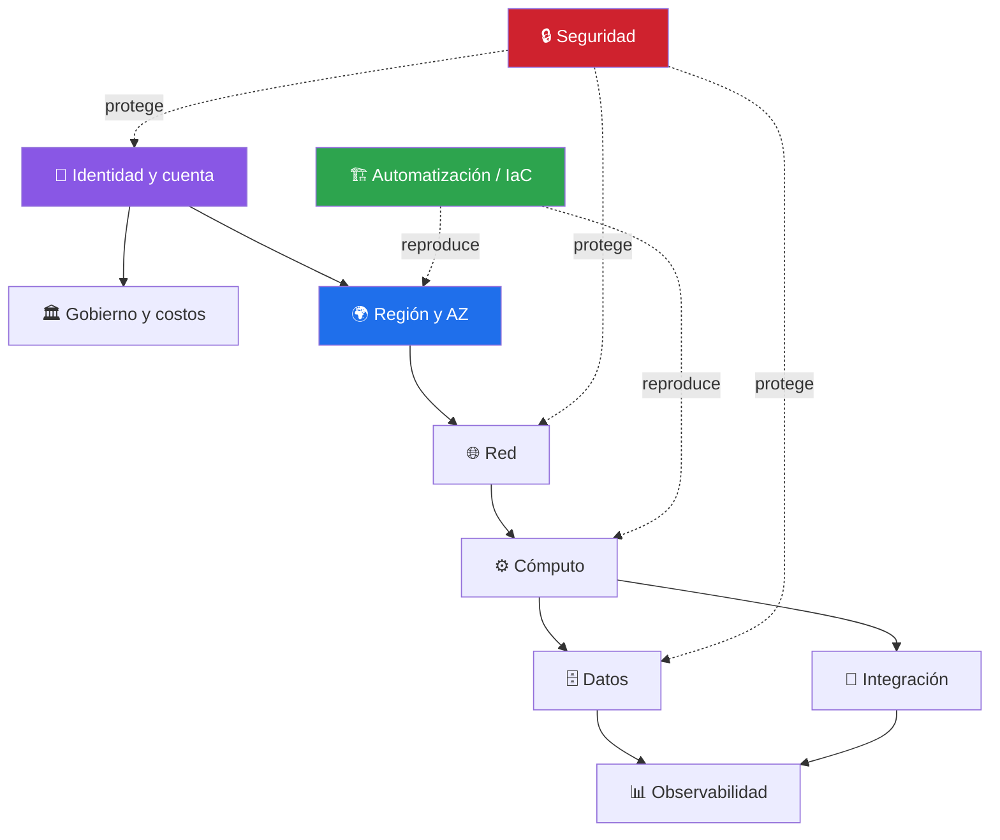

# 🧠 Modelo mental de AWS

[**← README**](../README.md) · [**🗺️ Mapa de servicios**](aws-service-map.md) · [**☁️ Modalidades**](03-modos-de-trabajo.md)

Piensa AWS en capas:



1. **Identidad y cuenta**: quién eres, qué cuenta, qué rol y qué políticas.
2. **Región/AZ**: dónde existe físicamente/lógicamente el recurso.
3. **Red**: VPC, subredes, rutas, seguridad, entrada/salida.
4. **Cómputo**: EC2, Lambda, ECS, EKS.
5. **Datos**: S3, EBS/EFS, RDS/Aurora, DynamoDB, Redshift.
6. **Integración**: API Gateway, EventBridge, SQS, SNS, Step Functions.
7. **Observabilidad**: CloudWatch, CloudTrail, X-Ray, Config.
8. **Seguridad**: IAM, KMS, Secrets Manager, WAF, GuardDuty, Security Hub.
9. **Automatización/IaC**: CloudFormation, CDK, Terraform externo, Systems Manager.
10. **Gobierno y costos**: Organizations, Control Tower, Budgets, Cost Explorer.

Toda arquitectura real atraviesa varias de estas capas. Por ejemplo una API serverless puede ser:

```text
Internet -> Route 53 -> CloudFront/WAF -> API Gateway -> Lambda
                                      -> SQS -> Lambda worker
                                      -> DynamoDB/S3
Observabilidad -> CloudWatch / CloudTrail
Identidad -> IAM
Secretos -> Secrets Manager/KMS
Despliegue -> CloudFormation/CDK
Costos -> Budgets/Cost Explorer
```
