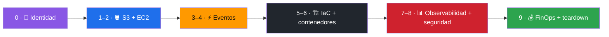

# 🧪 Laboratorios sugeridos

[**← README**](../README.md) · [**🗺️ Mapa de servicios**](aws-service-map.md) · [**📚 Tutoriales**](../README.md#-documentación)

> [!IMPORTANT]
> Ejecuta los laboratorios en una cuenta sandbox, con presupuesto y teardown. No uses root salvo una tarea que AWS reserve expresamente a esa identidad.

## Lab 0 — Identidad
Objetivo: configurar SSO, validar STS, distinguir cuenta/rol/región.

## Lab 1 — S3
Crear bucket desde consola/CLI, subir archivo, habilitar versionado y lifecycle; eliminar al terminar.

## Lab 2 — EC2
Crear una instancia pequeña dentro de una VPC de laboratorio, usar Security Group mínimo, observar estado desde AWS Desktop Studio y detenerla.

## Lab 3 — Serverless
API Gateway -> Lambda -> DynamoDB con logs CloudWatch.

## Lab 4 — Asíncrono
API -> SQS -> Lambda worker. Provocar retry y dead-letter queue.

## Lab 5 — IaC
Recrear Lab 3 usando CloudFormation o CDK. Destruir stack y comprobar limpieza.

## Lab 6 — Contenedores
Publicar imagen en ECR y ejecutar en ECS/Fargate.

## Lab 7 — Observabilidad
Dashboard CloudWatch, alarmas, logs con retención y CloudTrail.

## Lab 8 — Seguridad
Role de lectura, role operativo y demostración de `AccessDenied` bajo mínimo privilegio.

## Lab 9 — FinOps
Etiquetar recursos, revisar costo, definir budget y teardown checklist.
