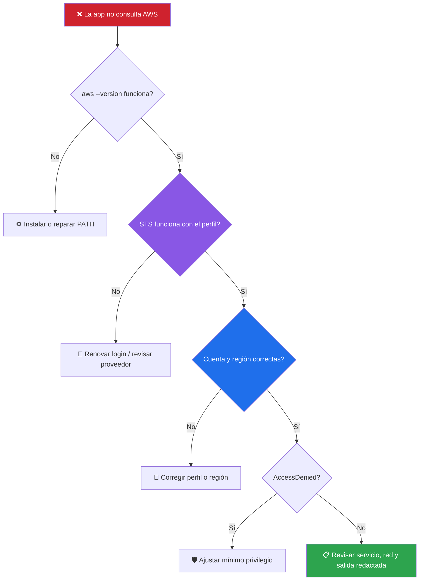

# 🧰 Troubleshooting

[**← README**](../README.md) · [**🚀 Instalación**](01-instalacion-y-conexion.md) · [**🛟 Soporte**](../SUPPORT.md)



## AWS CLI no detectado

```powershell
where.exe aws
aws --version
```

Si funciona en una terminal pero no en la aplicación, reinicia la sesión de Windows después de instalar/modificar PATH.

## El perfil aparece pero STS falla

```powershell
aws sts get-caller-identity --profile NOMBRE
```

Si es SSO:

```powershell
aws sso login --profile NOMBRE
```

## AccessDenied

La autenticación funcionó; el rol no autoriza la API solicitada. No soluciones esto dando `AdministratorAccess` sin análisis. Identifica la acción exacta y concede el mínimo permiso necesario.

## Recurso no aparece

Comprueba región y cuenta. Muchos recursos son regionales; IAM/S3 tienen particularidades globales.

## Cost Explorer falla

La identidad puede carecer de permisos de Billing/Cost Management o la organización puede restringir acceso. La app no intenta elevar permisos.

## EC2 start/stop falla

Comprueba estado actual, permisos IAM, protección/configuración de la instancia y región. Revisa el JSON/error AWS antes de reintentar.

## Proxy/firewall corporativo

AWS CLI debe poder alcanzar endpoints AWS. Valida primero con CLI fuera de la aplicación para separar un problema de red de uno de UI.
