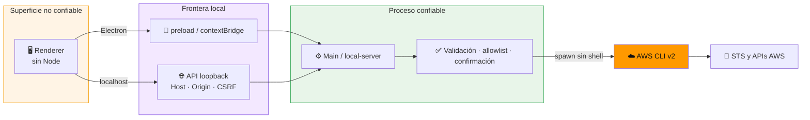

# 🏗️ Arquitectura interna

[**← README**](../README.md) · [**🔒 Seguridad**](../SECURITY.md) · [**✅ Evidencia**](VERIFICATION.md)

## 🛡️ Frontera de confianza

El renderer no tiene acceso directo a Node.js ni al filesystem. En Electron consume un conjunto pequeño de funciones expuestas por `preload.js`; en localhost utiliza `web-api.js`, que llama exclusivamente a la API HTTP loopback de `local-server.js`.

El servidor web escucha en `127.0.0.1`, valida `Host` y `Origin`, exige JSON y un token anti-CSRF para operaciones AWS, limita el cuerpo de las solicitudes y reutiliza la misma allowlist de comandos. No entrega credenciales al navegador. Las mutaciones EC2 no están expuestas en localhost.

## ☁️ Por qué AWS CLI como backend v0.1

- Reutiliza perfiles, SSO y roles existentes.
- Usa el proveedor oficial AWS Login para convertir una autenticación web en credenciales temporales sin leer cookies.
- Permite la cadena estándar del entorno y perfiles AssumeRole para cuentas o workloads distintos.
- No obliga a implementar almacenamiento de credenciales.
- Permite prototipar soporte multi-servicio rápidamente.
- El mismo comando puede reproducirse manualmente para diagnóstico.

## 🧭 Futuro SDK

Operaciones complejas pueden migrarse a AWS SDK para obtener tipado, paginación y experiencia más rica. La identidad seguirá delegada a proveedores estándares de AWS.

## 🔒 Controles

- Content Security Policy.
- `contextIsolation: true`.
- `nodeIntegration: false`.
- `sandbox: true`.
- permisos web denegados.
- navegación y ventanas emergentes bloqueadas.
- `shell:false`.
- validación de perfil/región/IDs.
- lectura por defecto.
- diálogo nativo antes de cambios EC2.
- inventario tolerante a denegaciones: cada resultado conserva si IAM autorizó o rechazó la consulta.
