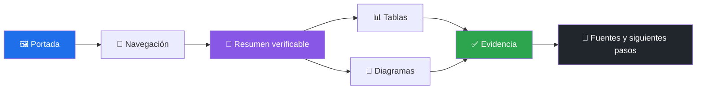

# 🎨 Estándar visual de documentación

[**← README**](../README.md) · [**📚 Índice documental**](../README.md#-documentación) · [**🤝 Contribuir**](../CONTRIBUTING.md)

> [!NOTE]
> Este sistema deriva de los repositorios públicos recientes del autor: portada centrada, evidencia visible, navegación corta, tablas escaneables y diagramas sólo cuando explican relaciones reales.

## 🧭 Principios

| Principio | Aplicación |
|---|---|
| Evidencia antes que decoración | Badges, cifras y estados enlazan a una fuente verificable. |
| Iconos semánticos | Un emoji identifica la función del título; no sustituye palabras. |
| Lectura por capas | Resumen y advertencias primero; detalle técnico después. |
| Honestidad visual | Verde significa verificado; ámbar significa desarrollo; rojo significa bloqueo o riesgo. |
| Navegación predecible | Cada documento enlaza al README y a sus vecinos relevantes. |
| Diagramas útiles | Mermaid se reserva para flujo, arquitectura, estados o dependencias. |

## 🎨 Paleta semántica

| Color | Hex | Significado |
|---|---:|---|
| Azul | `#1f6feb` | entrada, usuario, información o superficie principal |
| Violeta | `#8957e5` | coordinación, frontera o decisión |
| Verde | `#2da44e` | evidencia verificada o finalización |
| Ámbar AWS | `#ff9900` | integración AWS o atención |
| Rojo | `#cf222e` | bloqueo, riesgo o acción destructiva |
| Grafito | `#21262d` | proceso interno o infraestructura |

## 🧩 Gramática visual

## 🏷️ Iconos canónicos

| Dominio | Icono | Dominio | Icono |
|---|:---:|---|:---:|
| Inicio / propósito | 🎯 | Instalación / ejecución | 🚀 |
| AWS / nube | ☁️ | Identidad | 🪪 |
| Seguridad | 🔒 | Arquitectura | 🏗️ |
| Estado / evidencia | ✅ | Métricas | 📊 |
| Desarrollo | 🛠️ | Roadmap | 🗺️ |
| Costos | 💰 | Investigación | 🔬 |
| Release | 📦 | Soporte | 🛟 |

## 📐 Reglas de composición

1. El README usa banner, título, propuesta, badges, navegación y una advertencia de madurez antes del detalle.
2. Los documentos raíz usan un título con icono, navegación contextual y contenido orientado a decisiones.
3. Las guías técnicas empiezan con alcance y límites; los tutoriales declaran expresamente que son material educativo.
4. Las tablas mantienen encabezados breves, alineación consistente y no repiten párrafos completos.
5. Los diagramas incluyen texto accesible alrededor y colores con contraste; el color nunca es la única señal.
6. Los bloques `[!NOTE]`, `[!TIP]`, `[!IMPORTANT]` y `[!WARNING]` expresan significado, no énfasis decorativo.
7. No se usan badges manuales para cifras que no puedan comprobarse en código, tests, manifests o workflows.
8. Los contratos consumidos por máquinas, como `SKILL.md`, pueden omitir emoji en encabezados cuando una herramienta oficial dependa de la codificación local; la portabilidad prevalece sobre la decoración.

## ✅ Checklist editorial

- [ ] Título con icono semántico y jerarquía correcta.
- [ ] Navegación hacia README y documentos relacionados.
- [ ] Estado actual separado de referencias históricas.
- [ ] Tablas legibles también como texto plano.
- [ ] Mermaid válido y justificado por la complejidad.
- [ ] Enlaces relativos funcionales.
- [ ] Sin credenciales, cuentas, ARN privados ni OAuth efímero.
- [ ] Sin cifras o soporte de plataforma no verificables.
- [ ] UTF-8 sin mojibake.

`pnpm run check` ejecuta `scripts/check-docs.mjs` y rechaza títulos sin icono, navegación ausente, enlaces locales inexistentes, fences sin cerrar y diagramas Mermaid sin tipo reconocido.
