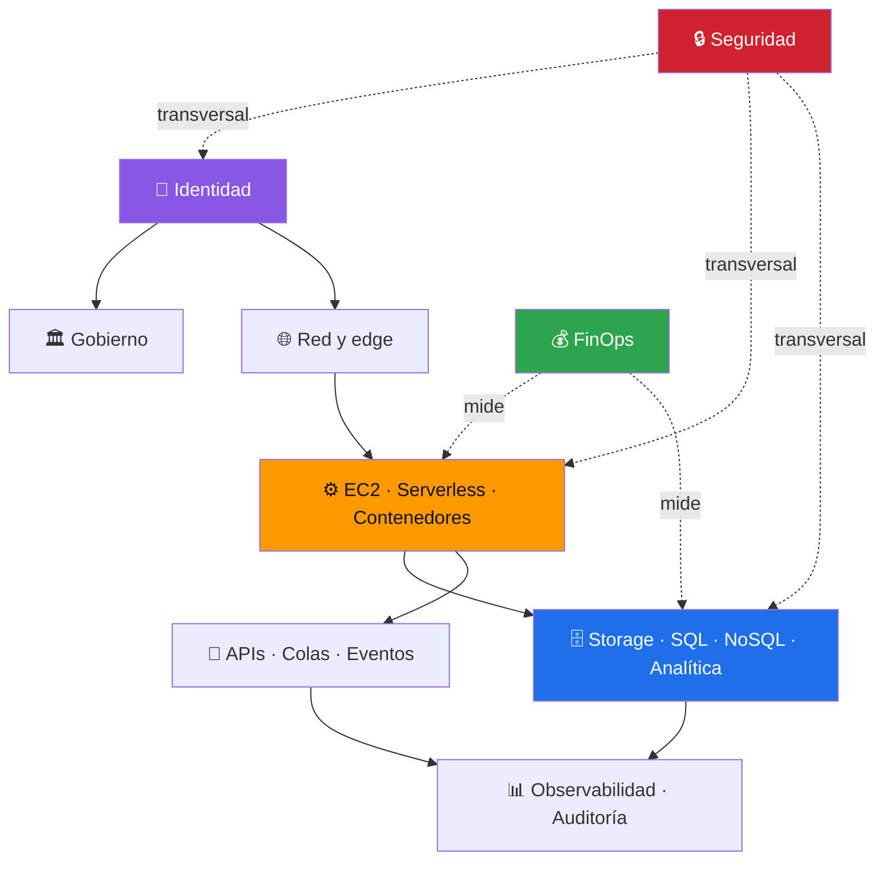

# 🗺️ Mapa de servicios y modalidades AWS

[**← README**](../README.md) · [**🧠 Modelo mental**](02-modelo-mental-aws.md) · [**🧪 Laboratorios**](05-laboratorios.md)

Este mapa no pretende listar literalmente cada SKU de AWS; organiza los servicios más relevantes por responsabilidad arquitectónica.

| Modalidad | Servicios representativos | Pregunta clave |
|---|---|---|
| Identidad | IAM, IAM Identity Center, STS | ¿Quién puede hacer qué? |
| Cómputo VM | EC2, Auto Scaling | ¿Necesito controlar el SO? |
| Serverless | Lambda | ¿Puedo ejecutar por eventos sin servidor persistente? |
| Contenedores | ECR, ECS, Fargate, EKS | ¿Mi unidad de despliegue es un contenedor? |
| Objetos | S3, Glacier classes | ¿Guardo blobs/archivos/backup/data lake? |
| Bloques/FS | EBS, EFS, FSx | ¿Necesito disco o filesystem? |
| Relacional | RDS, Aurora | ¿Necesito SQL/transacciones relacionales? |
| NoSQL | DynamoDB, ElastiCache, MemoryDB | ¿Necesito baja latencia, key-value o cache? |
| Analítica | Athena, Glue, Redshift, EMR | ¿Necesito consultar/procesar grandes datos? |
| Red | VPC, ELB, Route 53, Transit Gateway | ¿Cómo se conectan y aíslan mis sistemas? |
| Edge | CloudFront, Global Accelerator | ¿Cómo acerco contenido/tráfico al usuario? |
| API/eventos | API Gateway, EventBridge, SQS, SNS, Step Functions | ¿Cómo integro componentes desacoplados? |
| Observabilidad | CloudWatch, X-Ray | ¿Cómo sé qué está ocurriendo? |
| Auditoría | CloudTrail, Config | ¿Quién cambió qué y cuándo? |
| Seguridad | KMS, Secrets Manager, WAF, Shield, GuardDuty, Security Hub, Inspector | ¿Cómo reduzco, detecto y respondo riesgos? |
| IaC | CloudFormation, CDK | ¿Cómo reproduzco infraestructura? |
| DevOps | CodeBuild, CodePipeline, CodeArtifact | ¿Cómo automatizo build/deploy? |
| Gobierno | Organizations, Control Tower, Service Catalog | ¿Cómo gobierno muchas cuentas/equipos? |
| FinOps | Cost Explorer, Budgets, CUR | ¿Cuánto cuesta y por qué? |
| Backup/DR | AWS Backup, Elastic Disaster Recovery | ¿Cómo recupero ante pérdida/falla? |
| Migración | Migration Hub, DMS, DataSync | ¿Cómo llevo cargas/datos a AWS? |
| Híbrido | VPN, Direct Connect, Outposts, Storage Gateway | ¿Cómo conecto datacenter/local? |
| IA generativa | Bedrock | ¿Necesito FMs/agentes/RAG administrados? |
| ML | SageMaker | ¿Necesito entrenar/operar modelos ML? |
| IoT | IoT Core, Greengrass | ¿Conecto dispositivos/edge? |
